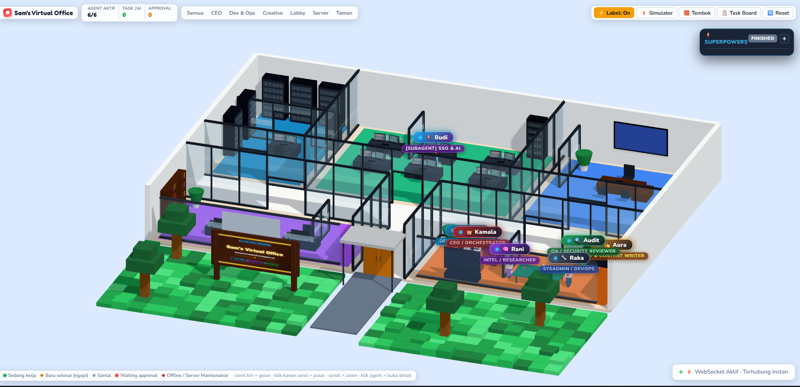

# 🏢 Sam's Virtual Office — 3D AI Agent Virtual Office

[](https://threejs.org/)
[](https://modelcontextprotocol.io/)
[](https://nodejs.org/)
[](https://opensource.org/licenses/MIT)



**Sam's Virtual Office** adalah aplikasi virtual office 3D interaktif real-time berbasis WebGL (Three.js) yang memvisualisasikan aktivitas dan alur kerja agen AI otonom (*Digital Twin* untuk AI Coding Agents).

Aplikasi ini dapat dikontrol secara langsung oleh berbagai coding agent (seperti **Antigravity**, **Claude Code**, **Cursor**, **Windsurf**, dan skrip mandiri) baik melalui **Model Context Protocol (MCP)**, **CLI Helper**, maupun **WebSocket Bridge**.

---

## ✨ Fitur Unggulan

- 🎮 **3D Open Space & Cyber Dark Themes:** Pilihan visualisasi kantor modern lengkap dengan Dev Lab, Creative Pods, Executive Strategy Room, Lounge Cafe, dan Outdoor Patio.
- 🤖 **A* Pathfinding & Smart Autonomous Seating:** Karakter bergerak dengan navigasi grid A* dan secara cerdas mencari 12 stasiun kursi kosong tanpa saling bertumpukan atau menimpa agen lain.
- 🌀 **3D Subagent Recruitment Portal:** Animasi pilar cahaya neon biru saat agen/subagent baru direkrut di Lobby.
- 📋 **Procedural Dynamic 3D Whiteboard:** Kanvas 2D interaktif yang dirender langsung ke mesh 3D di ruangan kantor untuk menampilkan checklist task dan stage terkini.
- 🔌 **Universal Model Context Protocol (MCP):** AI Agent dapat mengendalikan kantor 3D melalui native function calls (`office_spawn_agent`, `office_set_stage`, `office_update_whiteboard`, `office_agent_speak`).
- ☕ **Default Relaxing Lobby Mode:** Semua karakter secara default berkumpul dan bersantai di area lounge saat status idle, dan otomatis menuju meja kerja saat ada tugas aktif.

---

## ⚡ Panduan Cepat (Quick Start)

### 1. Menjalankan Server Kantor
```powershell
# Install dependensi (pertama kali):
npm install

# Menggunakan batch file:
.\start-server.bat

# Atau via npm:
npm start
```
Akses di browser Anda:
👉 **[http://localhost:8000](http://localhost:8000)** (Tema Utama: Open Space)

---

### 2. Mengendalikan Kantor 3D

#### Cara A: Menggunakan CLI Helper (`notify.js`)
```powershell
# 1. Memulai sesi Brainstorming
node notify.js --stage BRAINSTORMING --speaker kamala --msg "Mengeksplorasi arsitektur baru"

# 2. Menyusun Implementation Plan
node notify.js --stage WRITING_PLAN --speaker devin --msg "Menyusun checklist bite-sized task"

# 3. Merekrut Subagent Baru (Muncul di Portal Lobby)
node notify.js --spawn "Alex" --role "Frontend Engineer" --task "Menyusun UI Glassmorphism"

# 4. Menyelesaikan Semua Task (Kembali Santai di Lobby)
node notify.js --stage FINISHED --speaker kamala --msg "Semua task selesai dan lolos verifikasi!"
```

#### Cara B: Menggunakan Native MCP (Claude Code, Cursor, Windsurf, Antigravity)
Daftarkan `mcp-server.js` ke konfigurasi MCP Anda:
```json
{
  "mcpServers": {
    "sams-virtual-office": {
      "command": "node",
      "args": ["E:/VIBE-CODE-WS/Sam-Virtual-Office/mcp-server.js"],
      "env": {
        "SAMS_OFFICE_URL": "http://localhost:8000"
      }
    }
  }
}
```
Agent Anda kini dapat langsung memanggil tools:
- `office_set_stage`
- `office_spawn_agent`
- `office_update_whiteboard`
- `office_agent_speak`

#### Cara C: Menggunakan Python SDK (`office.py` untuk Hermes, OpenClaw, AutoGen)
```python
from office import OfficeReporter

reporter = OfficeReporter()

# Lapor ke kantor 3D dari agent Python mana saja
reporter.report_task(stage="BRAINSTORMING", agent_name="hermes", message="Menganalisis kode...")
reporter.spawn_worker(name="Neo", role="Security Auditor", task="Scanning smart contracts")
```

---

## 🎭 Simulasi Interaktif

Uji coba visualisasi kantor 3D dengan menjalankan skrip simulasi aktivitas kerja AI agent:
```powershell
npm run simulate
```

---

## 📚 Dokumentasi Lebih Lanjut

- 📖 **[Panduan Instalasi & Setup Lengkap](./INSTALL.md)** — Langkah instalasi dependensi, konfigurasi lintas perangkat, dan integrasi editor.
- 🏛️ **[Arsitektur Teknis Lengkap](./docs/ARCHITECTURE.md)** — Spesifikasi diagram data flow, koordinat tata ruang 3D, algoritma seating, dan protokol API.
